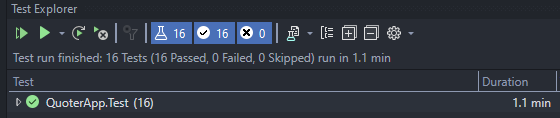

# Market Quoter Component

Your task is to implement market quoter component defined in *IQuoter* interface.

You have two methods to implement in *YourQuoter.cs*:
1. GetQuote
  - Takes instrument and quantity to quote, returns best possible price with current quotes
2. GetVolumeWeightedAveragePrice
  - Takes instrument id and calculates volume-weighted average price for the instrument

## MarketOrderSource

**It's a naive approach**
As I was allowed to change *MarkedOrderSource* so I made it return null if no more market orders are left.

By doing this I was able to fetch all market orders and know when there is no more left, this made producing quotes very slow since I'm bloked waiting for all market orders.

I was able to make it better by only fetching market orders once for Quoting and Volume Weighted Average Price calculation.

## Testing 

Used *NUnitTest* to write unit tests for *YourQuoter* class.  
Into *YourQuoter* injected a new instance of *IMemoryCache* with predictable mocked values.  

## Implementation Notes
Better implementation of this excercise can be found in [QuoterApp repository](https://github.com/Luke1453/QuoterApp)  

